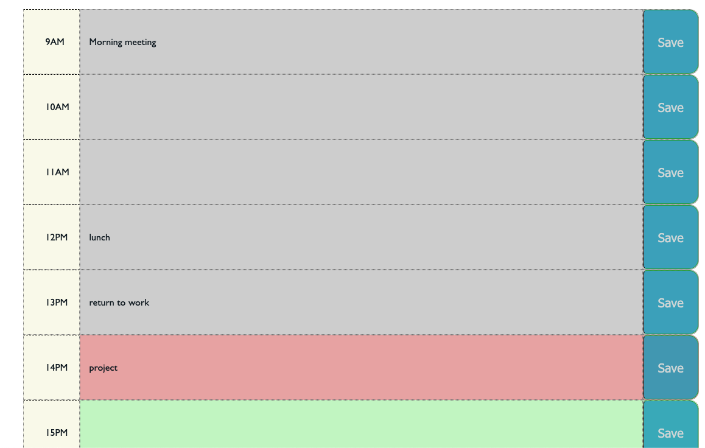

# <Simple Work Day>

# A simple calendar app for scheduling your work day

### application that provide simply way to let user schedule or track their work day events.

 

## Features

- each time block is color-coded to indicate whether it is in the past(grey), present(red), or future(green)

- after events has been saved, user can still access it even after refreshing the page.

- mobile friendly

)

)

---
## Project Status
Project is: _completed_ 

## Contact
Created by [Ruihan Gao] - feel free to contact me!

Email: toruig59@gmail.com

Project Link: [https://ahhyaya.github.io/Simple-Work-Day/](https://ahhyaya.github.io/Simple-Work-Day/)

